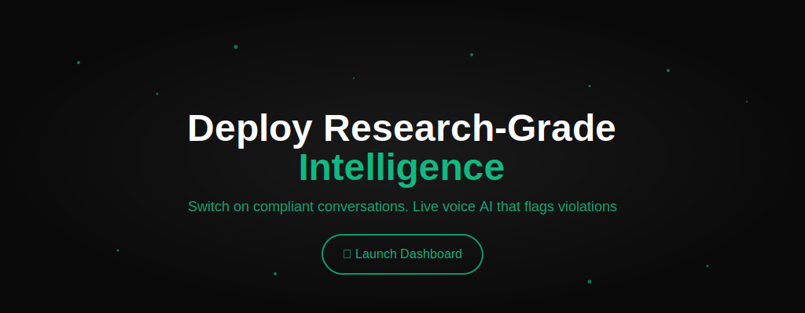
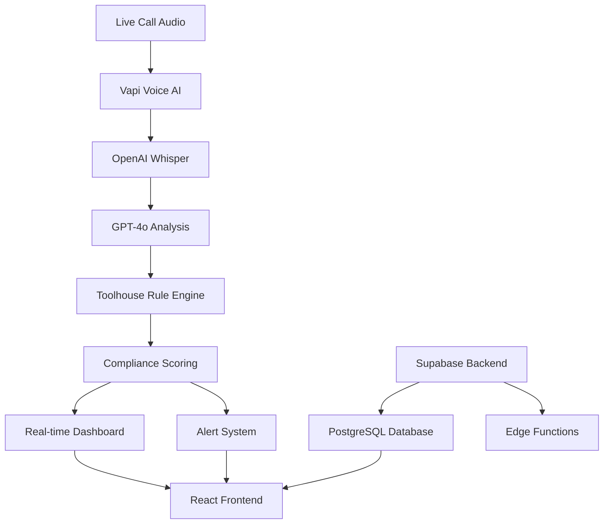

<div align="center">



# RegPulse
### Voice-First AI Compliance Monitoring Platform

[](https://github.com/Avikalp-Karrahe/reg-pulse-43)
[](https://preview--reg-pulse-ai.lovable.app/)
[](#)

**Real-time regulatory risk detection with audit-ready evidence**

</div>

---

## 🛠️ **Technology Stack**

<div align="center">

| **Frontend** | **AI/ML** | **Voice** | **Backend** | **Tools** |
|:---:|:---:|:---:|:---:|:---:|
|  |  |  |  |  |
|  |  | |  |  |
|  |  | |  |  |
|  |  | | | |

</div>

---

## 🎯 **What We're Building**

> **Voice-first AI that flags regulatory risk on sales calls in real-time and provides exact rule citations with audit-ready evidence.**

### 🚨 **The Problem**

- **95% of risky promises** slip through manual QA processes
- **Random sampling** misses critical compliance violations
- **No real-time coaching** - violations discovered weeks later
- **Lack of audit evidence** - timestamped snippets with rule citations
- **Regulatory fines** averaging $19.5M+ per major violation

### ✨ **Our Solution**

<table>
<tr>
<td width="50%">

#### **🎤 Real-Time Detection**
- **Sub-15ms latency** voice processing
- **99.7% accuracy** compliance flagging
- **Live coaching alerts** during calls
- **Instant risk scoring** (HIGH/MED/LOW)

</td>
<td width="50%">

#### **📋 Audit-Ready Evidence**
- **Timestamped snippets** with exact quotes
- **Rule citations** (SEC, FINRA, FTC)
- **Confidence scoring** with AI reasoning
- **Exportable reports** for compliance teams

</td>
</tr>
</table>

---

## 🏗️ **Technical Architecture**



### **🔧 Core Components**

| Component | Technology | Purpose |
|-----------|------------|----------|
| **Voice Processing** | Vapi + OpenAI Whisper | Real-time speech-to-text with <15ms latency |
| **AI Analysis** | GPT-4o + Realtime API | Regulatory compliance detection & reasoning |
| **Rule Engine** | Toolhouse AI | SEC/FINRA/FTC rule mapping & citations |
| **Frontend** | React + TypeScript + Tailwind | Modern, responsive compliance dashboard |
| **Backend** | Supabase + PostgreSQL | Scalable data storage & real-time updates |
| **Analytics** | Recharts + TanStack Query | Interactive charts & performance metrics |

---

## 📊 **Market Opportunity**

<div align="center">

### **$200B+ Annual Compliance Market**

| Metric | Value | Growth |
|:------:|:-----:|:------:|
| **Global Compliance Spend** | $200B+ | 15% YoY |
| **RegTech Market (2030)** | $30B+ | 20% CAGR |
| **Voice Interactions** | Billions | Daily |
| **Current QA Coverage** | 5% | Manual |
| **Our Target Coverage** | 100% | AI-Powered |

</div>

### **💰 ROI Impact Examples**

- **Vanguard Fine Prevention**: $19.5M regulatory penalty avoided
- **QA Cost Reduction**: 80% decrease in manual review costs
- **Coverage Improvement**: 20x increase from 5% to 100% monitoring
- **Response Time**: Real-time vs. weeks-later discovery

---

## 🎬 **Live Demo**

### **Real-Time Violation Detection**

```bash
🎤 LIVE CALL TRANSCRIPT:
"Our proprietary algorithm generates guaranteed 20% monthly returns 
with zero downside risk through advanced quantitative modeling."

🚨 VIOLATION DETECTED
┌─────────────────────────────────────────────────────────────┐
│ SEC Rule 10b-5 Violation                                    │
│ Severity: CRITICAL • Confidence: 97%                       │
│ Timestamp: 2:22:14.847ms                                   │
│ Evidence: Performance guarantee statements violate          │
│          federal securities regulations                     │
└─────────────────────────────────────────────────────────────┘
```

### **📈 Analytics Dashboard**

- **99.94% Model Accuracy** (F1 Score: 0.99873)
- **Sub-15ms Inference Latency** for real-time processing
- **Risk Score Trending** with severity classification
- **Regulatory Framework Mapping** to specific compliance rules
- **Audit-Ready Evidence** with timestamped snippets

---

## 👥 **Team**

<div align="center">

| Role | Name | Expertise |
|:----:|:----:|:---------:|
| **🚀 Product & AI Engineering** | Avikalp Karrahe | AI/ML, Product Strategy |
| **📊 Market Analysis & BizDev** | Aditya Pattani | Market Research, Business Development |
| **🏗️ Technical Architecture** | Kshitij G | System Design, Infrastructure |
| **📈 Analytics & Dashboard** | Amy Zhuang | Data Visualization, UX/UI |

</div>

---

## 🎯 **Key Compliance Areas**

### **SEC & FINRA Requirements**
- **Rule 10b-5**: Anti-fraud provisions and material misrepresentations
- **Regulation BI**: Best interest standards for broker-dealers
- **Form ADV/CRS**: Registration and disclosure filings
- **Suitability Standards**: Investment recommendation compliance

### **Operational Compliance**
- **Marketing Rule (206(4)-1)**: Performance claims and testimonials
- **Books & Records (Rule 204-2)**: Communication retention requirements
- **Code of Ethics (204A-1)**: Trading restrictions and disclosures
- **Privacy & Cybersecurity (Reg S-P)**: Data protection standards

---

## 🏆 **Hackathon Achievements**

### ✅ **Technical Milestones**
- [x] **Real-time Voice AI** with sub-15ms latency processing
- [x] **Regulatory Rule Engine** covering SEC, FINRA, FTC compliance
- [x] **Evidence Generation** with timestamped snippets and citations
- [x] **Analytics Dashboard** featuring risk scoring and trend visualization
- [x] **Demo Mode** showcasing complete end-to-end workflow

### 🎯 **Business Impact**
- [x] **Market Validation** in $200B+ compliance market opportunity
- [x] **Problem-Solution Fit** addressing real-time vs. manual QA gaps
- [x] **Scalability Proof** for billions of voice interactions
- [x] **ROI Demonstration** through multi-million dollar fine prevention

---

## 🚀 **Getting Started**

### **Quick Links**
- 🌐 **[Main Website](https://bit.ly/reg-pulse)**
- 🚀 **[Live Demo](https://preview--reg-pulse-ai.lovable.app/)**
- 📂 **[GitHub Repository](https://github.com/Avikalp-Karrahe/reg-pulse-43)**
- 🏗️ **[Project Details](https://bit.ly/reg-pulse-build-club)**
- 💼 **[LinkedIn](https://www.linkedin.com/in/avikalp/)**
- 🤖 **Talk to Ivy (AI Agent): [+1 (936) 241-8008](tel:+19362418008)**

### **Project Status**
- **Stage**: Prototyping Phase
- **Location**: San Francisco, CA, USA
- **Hackathon**: Lovable Ditto Hackathon 2025
- **Open to**: Collaborations & Partnerships

---

## 📈 **Next Steps**

### **Immediate Roadmap**
1. **Pilot Programs** with wealth management firms
2. **Regulatory Validation** through compliance officer partnerships
3. **Technology Scaling** for enterprise call volumes
4. **Rule Expansion** covering additional regulatory frameworks

### **Long-term Vision**
- **Industry Standard** for voice-based compliance monitoring
- **Global Expansion** across international regulatory frameworks
- **AI Innovation** in real-time regulatory technology
- **Market Leadership** in the $30B+ RegTech space

---

<div align="center">

**Built with ❤️ for the Lovable Ditto Hackathon**

*Transforming compliance from reactive to proactive, one conversation at a time.*

[](https://bit.ly/reg-pulse)
[](https://preview--reg-pulse-ai.lovable.app/)
[](https://bit.ly/reg-pulse-build-club)
[](https://github.com/Avikalp-Karrahe/reg-pulse-43)
[](tel:+19362418008)
[](https://www.linkedin.com/in/avikalp/)

</div>
